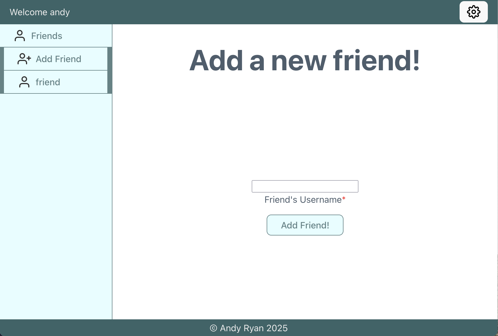
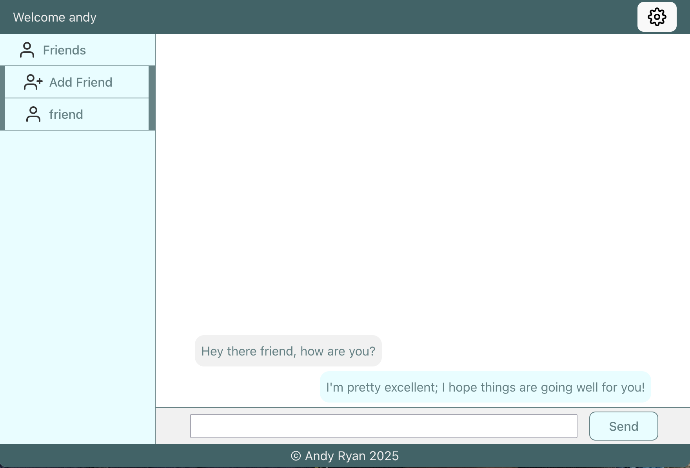

# Messenger App Frontend 

Built as part of [The Odin Project](https://www.theodinproject.com) curriculum.

## Table of Contents

- [Description](#description)
- **For End Users**
  - [Where to View on the Web](#where-to-view-on-the-web)
  - [Usage and Screenshots](#usage-and-screenshots)
- **For Developers**
  - [Future Improvements](#future-improvement-ideas)
  - [Installation Instructions](#installation-instructions)
  - [Technologies Used](#technologies-used)
  - [Dependencies and Credits](#dependencies-and-credits)
  - [Project Structure](#project-structure)

## Description

This is a simple messaging app.

### Features

- Add friends
- Chat with friends

## Where to View on The Web

[Try it out online](https://messenger-frontend-top.pages.dev/login)
  - Please be patient when signing up or logging in as the database needs a bit to spin up

## Usage and Screenshots




After creating your account you can sign in to add friends and start chatting.

- [Link to live preview](https://messenger-frontend-top.pages.dev/login)
- [Link to backend repo](https://github.com/aRav3n/messenger-backend)

## Future Improvement Ideas

- Improved user account management
  - Change username, password, etc.
- Automatically log in after creating account

## Installation Instructions

1. If you haven't already, [install Node.js and npm](https://www.theodinproject.com/lessons/foundations-installing-node-js)
   - Note that installing Node.js [also installs npm](https://www.theodinproject.com/lessons/foundations-installing-node-js#step-2-setting-the-node-version)
1. Fork this repo
1. In your copy of the repo click the green **Code** button and copy the URL
1. Open your IDE
1. `cd PARENT_DIRECTORY_FOR_THIS_PROJECT`
1. `git clone COPIED_URL`
1. `cd PROJECT_FOLDER`
1. Run the following in your terminal
   ```bash
   npm init -y
   npm install
   ```
1. If running the API locally
   1. Find the URL
      - For a Node.js / Express app this would be in: _backend_folder/app.js_ at the bottom
   2. Update the API URL
      1. ```bash
         code src/functions/apiCommunication.js
         ```
      1. Update `const apiUrl` with the new URL. (It is likely http://localhost:3000)
         - Be sure to remove the trailing "/" if there is one
1. ```bash
   npm run dev
   ```

   - `^` + `c` will end the process

1. Navigate to the url displayed in the terminal: `➜  Local:   http://localhost:5173/`

## Technologies Used

- <a href="https://developer.mozilla.org/en-US/docs/Web/CSS"> CSS</a>
- <a href="https://eslint.org/"> ESLint</a>
- <a href="https://developer.mozilla.org/en-US/docs/Web/HTML"> HTML</a>
- <a href="https://developer.mozilla.org/en-US/docs/Web/JavaScript"> JavaScript</a>
- <a href="https://react.dev/"> React</a>
- <a href="https://vite.dev/"> Vite </a>

### Development Tools

- <a href="https://code.visualstudio.com/"> VS Code</a>
- <a href="https://www.npmjs.com/"> npm</a>
- <a href="https://git-scm.com/"> Git</a>

### Hosting

- <a href="https://www.cloudflare.com/"> Cloudflare</a>
- <a href="https://github.com/"> Github</a>

## Dependencies and Credits

### Package Dependencies

- [react](https://www.npmjs.com/package/react)
- [react-dom](https://www.npmjs.com/package/react-dom)
- [react-router-dom](https://www.npmjs.com/package/react-router-dom)
- [@eslint/js](https://www.npmjs.com/package/@eslint/js)
- [@types/react](https://www.npmjs.com/package/@types/react)
- [@types/react-dom](https://www.npmjs.com/package/@types/react-dom)
- [@vitejs/plugin-react](https://www.npmjs.com/package/@vitejs/plugin-react)
- [eslint](https://www.npmjs.com/package/eslint)
- [eslint-config-prettier](https://www.npmjs.com/package/eslint-config-prettier)
- [eslint-plugin-react-hooks](https://www.npmjs.com/package/eslint-plugin-react-hooks)
- [eslint-plugin-react-refresh](https://www.npmjs.com/package/eslint-plugin-react-refresh)
- [globals](https://www.npmjs.com/package/globals)
- [vite](https://www.npmjs.com/package/vite)

### Other Credits

- [Feather icons](https://feathericons.com/)
- [Devicion](https://devicon.dev/)
- [Skillicons](https://skillicons.dev/)

## Project Structure

```bash
├──public/                       # Locally hosted images and icons
    ├──add_friend_screenshot.png
    ├──at-sign.svg
    ├──chat_screenshot.png
    ├──menu.svg
    ├──message-square.svg
    ├──plus-square.svg
    ├──settings.svg
    ├──user-plus.svg
    └──user.svg
├──src/                          # Source files
    ├──components/               # React components
        ├──partials/             # Smaller React components
            ├──Conversation.jsx
            ├──ErrorMessage.jsx
            ├──Footer.jsx
            ├──Header.jsx
            ├──SettingsMenu.jsx
            └──SidebarMenu.jsx
        ├──App.jsx
        ├──DeleteAccount.jsx
        ├──ErrorPage.jsx
        ├──Login.jsx
        ├──MainBody.jsx
        ├──NewFriend.jsx
        ├──Signup.jsx
        ├──main.jsx
        └──userInfo.jsx
    ├──functions/                # Reusable functions
        ├──apiCommunication.js
        └──localStorage.js
    └──styles/                   # CSS files
        ├──App.css
        └──index.css
├──.gitignore
├──LICENSE
├──README.md
├──eslint.config.js
├──index.html
├──package-lock.json
├──package.json
└──vite.config.js
```
